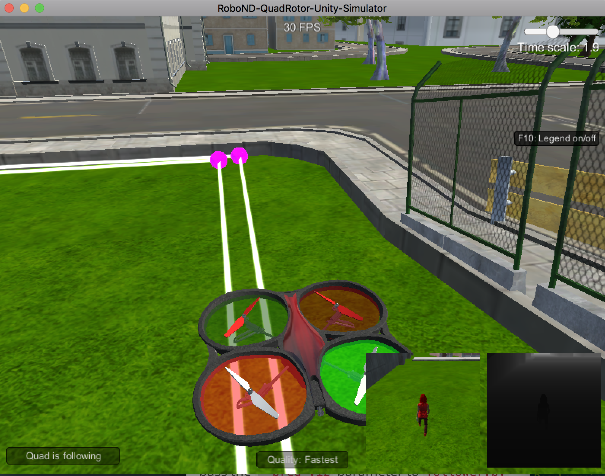
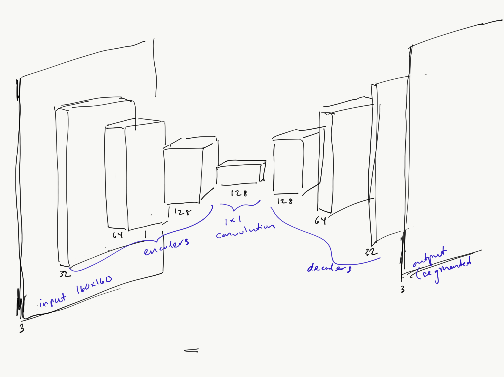
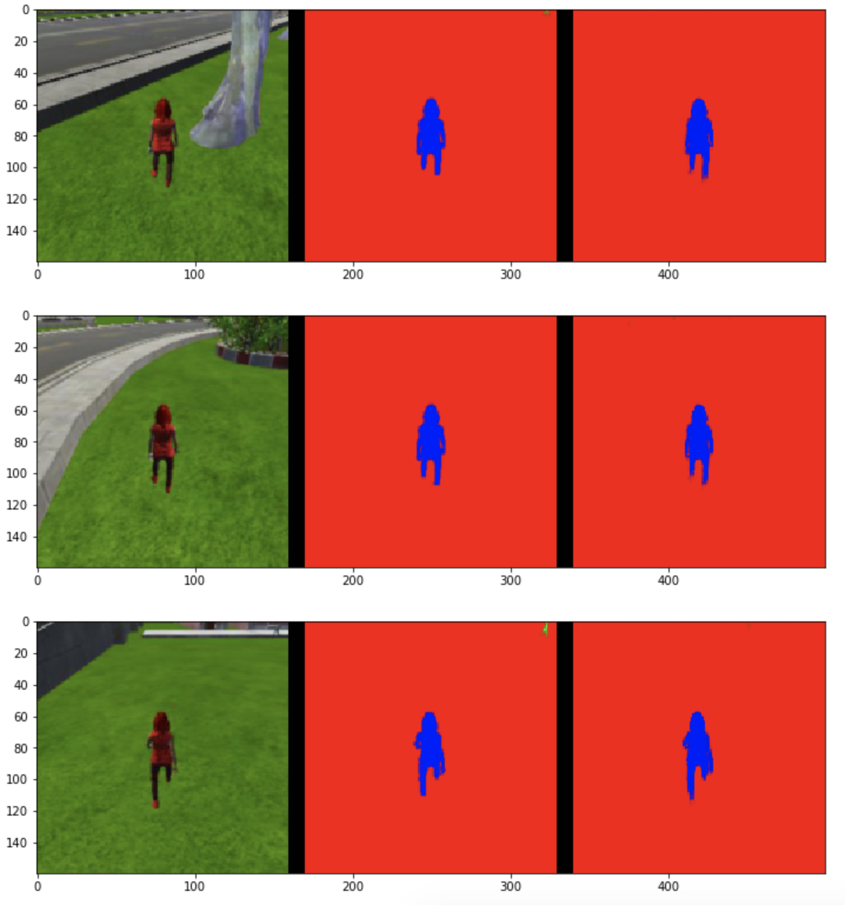
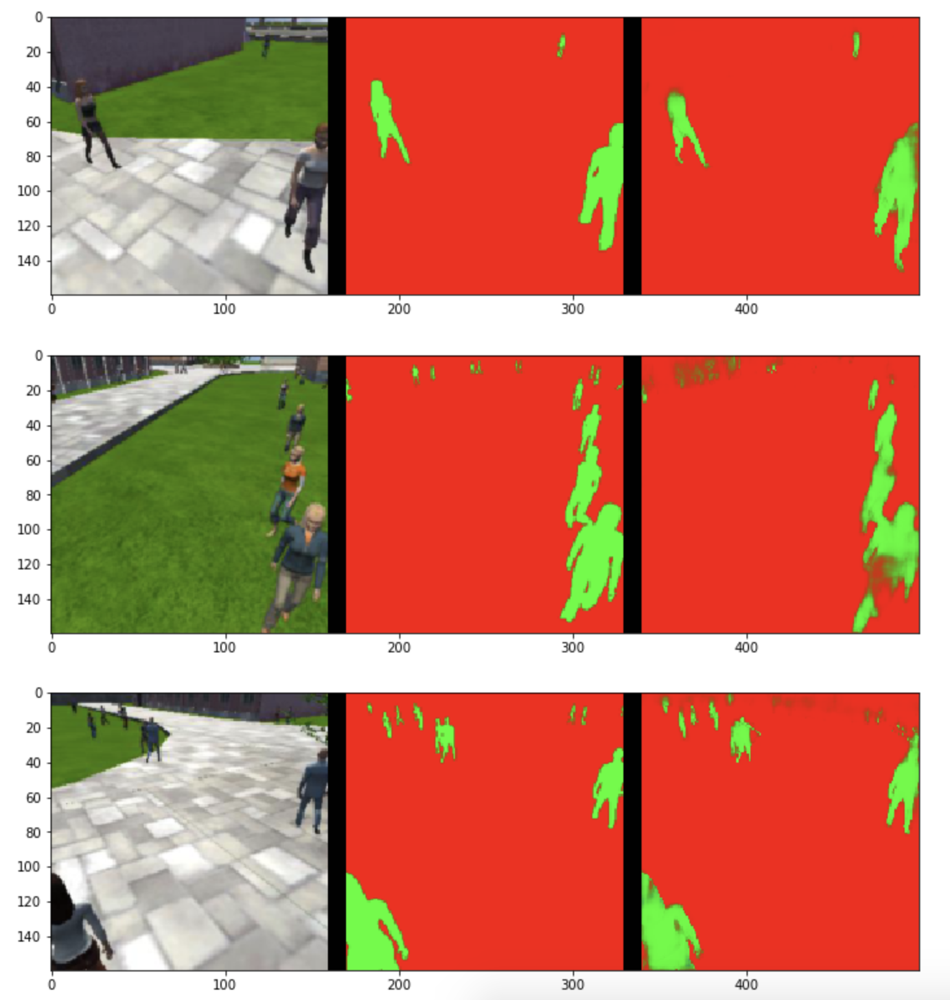
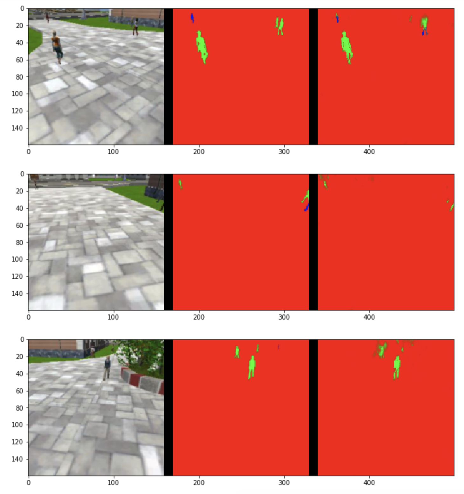
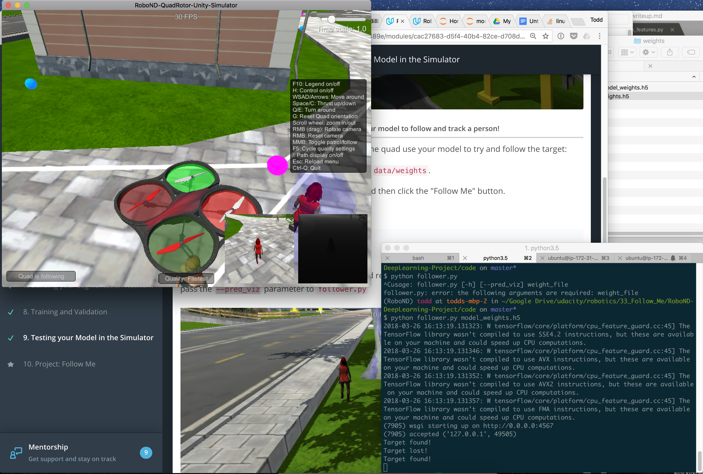

# Follow Me

## Network Architecture

The goal of the project was to do semantic segmentation on each pixel in the images from the drone's video feed using a fully convolutional network (FCN) to follow a hero figure.



Comparing an FCN to a CNN (Convolutional Neural Network), both have an encoder section with convolution layers, but an FCN does not have a final connected layer. Instead, an FCN has a 1x1 convolution layer and a decoder section with transposed and upsampled convolution layers.

The **encoder** section extracts features from the input images where each layer allows the model to identify successively higher level features, e.g. initially lines or brightness, to shapes such as a square or circle, to ultimately a person or dog, etc. The separable convolutional layer uses batch normalization so instead of just normalizing the inputs to the network, we normalize the inputs to layers within the network. This optimizes performance by allowing networks to train and converge faster and allow training of deeper networks.

The key benefit of the FCN is it helps retain spatial information. So instead of answering "is this a hot dog?" such as with CNNs, it can say "where is the hot dog?". This is done via using a **1x1 convolution layer** that makes the network deeper and can accomodate more parameters without adding a lot of computation (since it's just matrix multiplication). 

The **decoder section** upsamples the data so the end output is the same size as the input image. This allows us to do semantic segmentation. A bilinear upsampling method is applied which utilizes the weighted average of the 4 nearest known pixels located diagonally to estimate new pixel intensity. It is somewhat prone to lose some finer details, but it also helps speed up performance. Next, layer concatenation is applied for skipped connections so more precise segmentation decisions can be made. The advantage of concatenating layers is that it offers a bit of flexibility because the depth of the input layers need not match up and this helps simplify the implementation as well. It is helpful to add some regular or separable convolution layers after this step for the model to learn those finer spatial details. These separable convolutional layers use (like the ones in the encoder) use batch normalization as an additional way to optimize network training. Instead of just normalizing the inputs to the network, we normalize the inputs to layers within the network.

Below is a diagram of the network that was used:


Three encoder blocks and three decoder blocks were used. Initially I only had two of each layer type but I got better results with adding these additional layers. Using the same hyperparameters, `final_score` went from `0.306` to `0.382` before I adjusted any hyperparameters from my initial selection.

## Network Parameters

The following hyper parameters are what I chose for my model after trying out various alternatives:
```
learning_rate = 0.001
batch_size = 40
num_epochs = 40
steps_per_epoch = num_training // batch_size + 1
validation_steps = num_validation // batch_size + 1
workers = 10
```

The `learning_rate` was set to be low at `0.001` since the `batch_size` was relatively small. A large `learning_rate` with a small `batch_size` could result in unstable gradients. 

The `steps_per_epoch` and `validation_steps` were chosen such that all the training and validation would be trained in every epoch.

The `num_epochs` was put at `40` after increasing it from `20` which helped with the overall score. However, further increasing the epochs could result in overfitting while too few epochs could result in underfitting.

## Results

With this model, the `final_score` of my model was **0.418**, while the final IoU was 0.557.

The following images show examples of model output. The leftmost image is the raw image, the middle is the goal, and the right is what the model is classifying as hero. The target is in blue and non-target are in green.

The model does well when the target is at close range. The IoU for the target hero was **0.891**.


The model does pretty well segmenting non-targets but sometimes the segmentation misses some parts of non-target humans. The IoU for non-target was **0.748**. Some further tweaking with skipped connections might help with this.


The model doesn't do as well segmenting far away targets. The IoU for the hero target was **0.224**. Additional training images could help with this.


In practice, when providing the weights from the model to the simulator, the model didn't have any trouble following the target since it largely fell in the first situation of being fairly close when first spotting the target.


## Future Enhancements and Limitations

There many enhancements I could have made. One big one would be acquiring additional training data to particularly address weaknesses in detecting the target from far away.

My hyperparameter optimization was not extremely exhaustive and a more systematic approach with grid/random search for better model selection should be adopted as I continue to improve my model.

This particular neural network is limited in that it would not work the best for another object it had not yet seen such as a dog, cat, or car. I would need to get training data for other types of targets and also retrain the model from scratch to account for these additional types of targets.